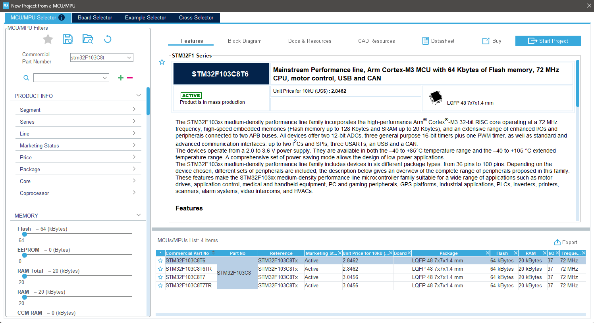
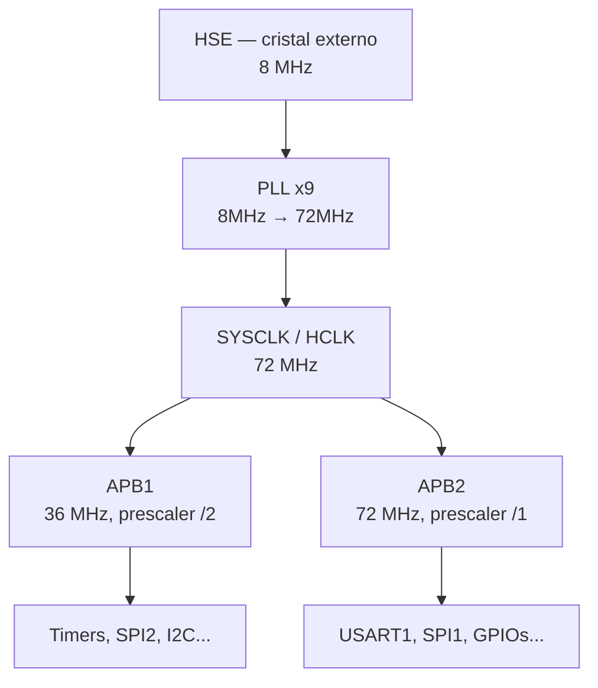
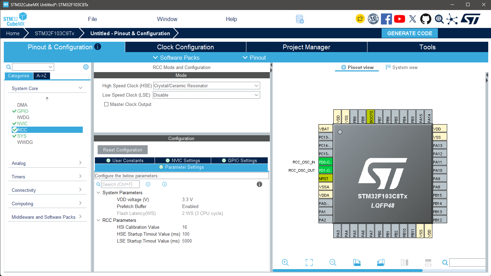
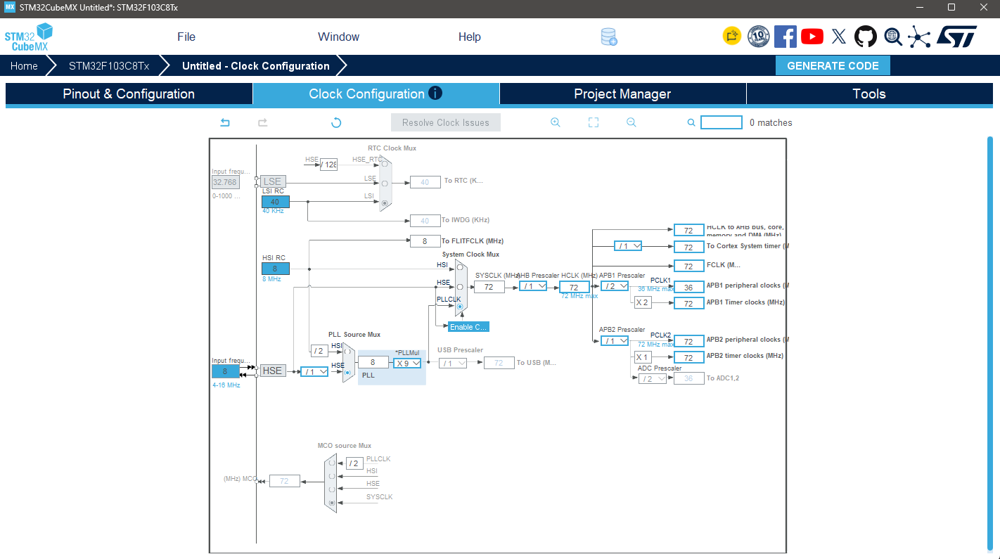
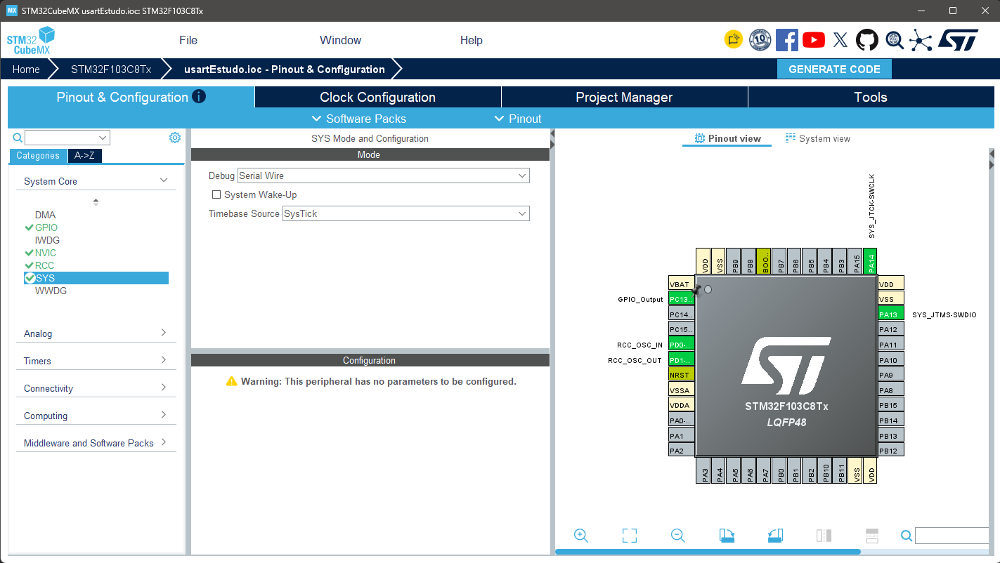
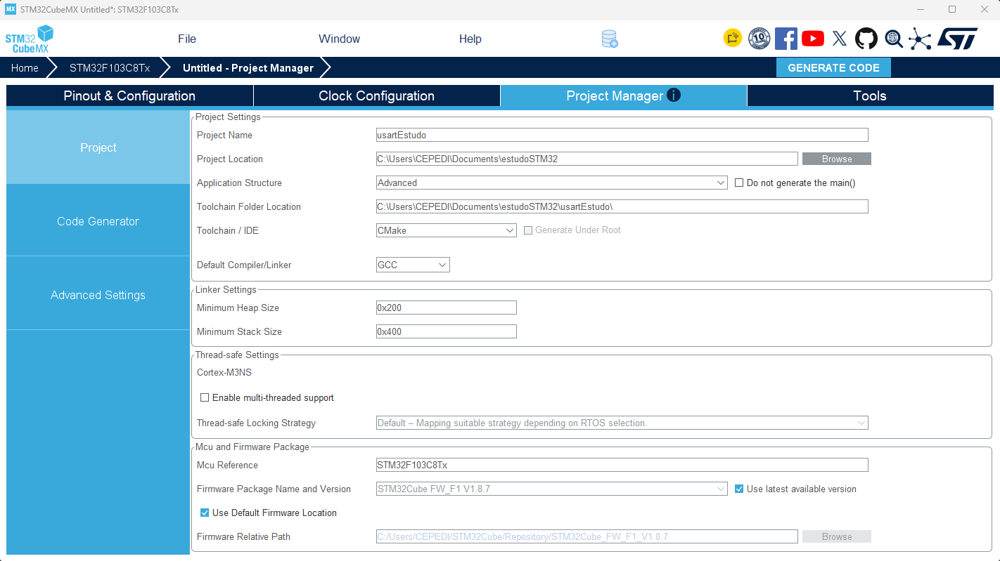
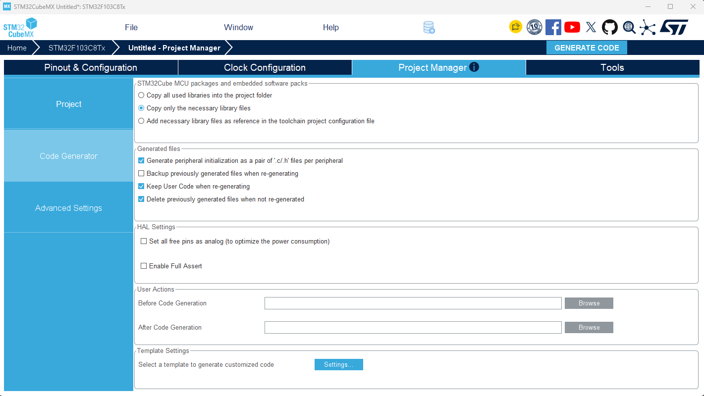

# Introdução — STM32 + FreeRTOS

## Parte 1 — Configuração inicial (clock + debug)

## Sobre este manual

Registro didático do aprendizado prático de STM32 + FreeRTOS, em ordem cronológica: cada configuração feita, o porquê por trás dela, e os conceitos que ela ensina.

**Escopo desta parte:** configuração inicial do projeto, ou seja, **clock** (HSE + PLL + barramentos) e **debug** (Serial Wire), mais a geração do projeto. Nenhum periférico é configurado aqui. A USART e os demais periféricos ficam para os próximos manuais, que partem do projeto gerado nesta parte.

**Hardware em uso:** STM32F103C8T6 "Blue Pill" + ST-Link V2
**Ambiente:** STM32CubeMX + uma das duas IDEs abaixo (à escolha)

## Setup do ambiente

### Escolha da IDE

O STM32CubeMX gera a mesma configuração de hardware para qualquer IDE. O que muda é o *formato de projeto* gravado no disco, escolhido no campo **Toolchain / IDE** do Project Manager (ver seção mais adiante).

| | Opção A — VS Code | Opção B — STM32CubeIDE (Eclipse) |
| --- | --- | --- |
| Ferramenta | Extensão oficial "STM32CubeIDE for Visual Studio Code" (publisher STMicroelectronics) | STM32CubeIDE, IDE própria da ST baseada em Eclipse |
| Formato do projeto | **CMake** | Projeto Eclipse (`.project` / `.cproject`) |
| Valor em Toolchain / IDE | **CMake** | **STM32CubeIDE** |
| Ponto forte | CMake é uma habilidade transferível para outros projetos C/C++ | Ambiente tudo-em-um: toolchain, debug com ST-Link e configuração de pinos integrados |
| Ponto de atenção | Depende da extensão para importar e depurar o projeto | Formato proprietário, específico do ecossistema Eclipse/ST |

**Detalhe importante no CubeMX:** a escolha de Toolchain / IDE *não troca a IDE em si*, apenas o formato dos arquivos gerados. Usar o formato errado para a IDE errada é o erro mais comum:

- Projeto gerado como **"STM32CubeIDE"** → formato Eclipse, **não abre corretamente no VS Code**
- Projeto gerado como **"CMake"** → formato que a extensão do VS Code reconhece e importa

### Passos realizados

**Comuns às duas opções**

1. Instalado STM32CubeMX (v6.11+)
2. Criado projeto no CubeMX selecionando o MCU diretamente — **STM32F103C8Tx** — em vez de buscar por uma placa (board), já que a Blue Pill não é uma placa oficial ST e não aparece no seletor de boards (detalhes na seção **Seleção do MCU**)

**Opção A — VS Code**

1. Instalado VS Code
2. Instalada a extensão "STM32CubeIDE for Visual Studio Code" (publisher STMicroelectronics)

**Opção B — STM32CubeIDE** *(passos a confirmar na prática)*

1. Instalado o STM32CubeIDE (download no site da ST)
2. Não é preciso instalar mais nada para compilar e gravar: a toolchain ARM GCC e o suporte ao ST-Link já vêm junto com a IDE

<!-- 📷 IMAGEM OPCIONAL — Tela inicial do STM32CubeIDE com o workspace aberto (sugestão: images/cubeide_workspace.png) -->

**ST-Link V2:** usado para gravação e debug via SWD. Diferente da Nucleo, a Blue Pill não tem debugger embutido — o ST-Link é uma peça externa separada. Vale para as duas IDEs.

## Seleção do MCU

**Onde configurar:** CubeMX → tela inicial → **File → New Project** (ou o botão "ACCESS TO MCU SELECTOR")

**MCU Selector vs Board Selector:** o CubeMX oferece duas formas de começar um projeto. O *Board Selector* parte de uma placa oficial da ST (Nucleo, Discovery), já com pinos e periféricos pré-configurados. A Blue Pill não é uma placa oficial ST e não aparece nesse seletor, por isso o caminho é o **MCU Selector**, escolhendo o chip diretamente.

### Passos realizados

1. Na janela "New Project", aba **MCU/MPU Selector**
2. No campo de busca (Commercial Part Number), digitar **STM32F103C8**
3. Na lista de resultados, selecionar **STM32F103C8Tx**
4. Conferir as características do chip no painel de informações
5. Clicar em **Start Project** (canto superior direito da janela)

### Características do MCU escolhido

| Item | Valor | Observação |
| --- | --- | --- |
| Part number | STM32F103C8T6 | O sufixo "Tx" no CubeMX cobre a variante de temperatura, por isso aparece como STM32F103C8**Tx** |
| Núcleo | ARM Cortex-M3 | Roda a até 72 MHz, valor que será usado na árvore de clock |
| Encapsulamento | LQFP48 | Aparece no desenho do chip na aba Pinout |
| Flash | 64 KB | Memória do programa |
| RAM | 20 KB | Limite que pesa na hora de dimensionar as stacks do FreeRTOS |

**Por que escolher o MCU certo logo no início:** o CubeMX gera pinout, clock máximo, drivers HAL e arquivos de startup específicos para esse chip. Trocar o MCU depois é possível, mas obriga a revisar toda a configuração. O campo **Mcu Reference** no Project Manager (mais adiante) confirma que o chip escolhido aqui é o mesmo do projeto gerado.

<!-- 📷 IMAGEM — Janela New Project com a aba MCU/MPU Selector e o STM32F103C8Tx selecionado (sugestão: images/mcu_selector.png) -->

## Clock tree — conceito e configuração

**O que é a árvore de clock:** todo periférico do STM32 precisa de um sinal de clock para funcionar — o "batimento cardíaco" que sincroniza cada operação. O microcontrolador não tem um clock único: uma fonte original passa por multiplicadores e divisores até virar vários clocks diferentes, cada um alimentando um grupo de periféricos.

**HSE (High Speed External):** sinal de um cristal de quartzo físico soldado na placa (8 MHz na Blue Pill). Por que não HSI (oscilador interno)? O HSI é impreciso — varia com temperatura. Para periféricos que dependem de timing preciso entre dois dispositivos (como UART, onde dois lados precisam concordar sobre a duração exata de cada bit), um cristal externo estável é essencial.

**PLL (Phase-Locked Loop):** circuito multiplicador de frequência. O cristal físico entrega só 8 MHz, mas o núcleo Cortex-M3 roda no máximo a 72 MHz. O PLL multiplica o sinal (8 × 9 = 72) para atingir o clock máximo do chip.

**SYSCLK / HCLK:** SYSCLK é o clock principal do sistema (saída do PLL, 72 MHz). HCLK é esse clock distribuído para o barramento AHB, que alimenta CPU, memória e DMA — por isso os dois têm o mesmo valor.

**APB1 e APB2:** dois sub-barramentos que distribuem o clock para grupos diferentes de periféricos. Por limitação de hardware do STM32F103, o APB1 tem teto de 36 MHz (prescaler /2 reduz os 72 MHz pela metade), enquanto o APB2 aguenta os 72 MHz completos (prescaler /1).

### Passos realizados no CubeMX

1. RCC → High Speed Clock (HSE) → mudado de "Disable" para "Crystal/Ceramic Resonator"

<!-- 📷 IMAGEM 1 — Tela do RCC com HSE em "Crystal/Ceramic Resonator" (arquivo: images/rcc_config.png) -->

2. Aba Clock Configuration → PLL Source Mux → selecionado HSE
3. PLL Multiplier (\*PLLMul) → alterado de X2 para X9
4. System Clock Mux → selecionado PLLCLK
5. APB2 Prescaler → confirmado em /1 (mantendo 72 MHz completo)
6. APB1 Prescaler → mantido em /2 (36 MHz, limite do barramento)

<!-- 📷 IMAGEM 2 — Aba Clock Configuration completa, mostrando 72 MHz no HCLK e 36 MHz no APB1 (arquivo: images/clock_configuration.png) -->

## Configuração do SYS (debug via Serial Wire)

**Onde configurar:** CubeMX → aba Pinout & Configuration → System Core → SYS

**O que é o SYS:** bloco do CubeMX que agrupa configurações de sistema que não pertencem a nenhum periférico específico. Aqui ficam o modo de debug e a fonte de tempo (timebase) da HAL. Ele não tem aba de parâmetros ("This peripheral has no parameters to be configured" é esperado): tudo é definido na seção **Mode**.

### Mode

| Campo | Valor | Por quê |
| --- | --- | --- |
| Debug | Serial Wire | Ativa o SWD, protocolo de debug de 2 fios usado pelo ST-Link V2 |
| System Wake-Up | Desmarcado | Habilita o pino PA0 para acordar o chip de modos de baixo consumo (Standby). Não é relevante nesta fase |
| Timebase Source | SysTick | Timer do núcleo Cortex-M3 que a HAL usa para gerar a base de tempo de 1 ms (`HAL_Delay`, timeouts) |

**Por que Serial Wire e não JTAG:** o SWD usa só 2 pinos (**PA13 = SWDIO**, **PA14 = SWCLK**), contra 4 ou 5 do JTAG. Os pinos que o JTAG ocuparia (PA15, PB3, PB4) ficam livres para outros usos. Para gravar e debugar com o ST-Link V2, SWD é tudo o que precisa.

**Por que configurar isso explicitamente:** no STM32F1, o CubeMX vem com Debug em "No Debug" por padrão. Se você gerar e gravar o projeto assim, o firmware reconfigura PA13 e PA14 como GPIO comuns, e o ST-Link perde a conexão com a placa. Sem ela, não dá para regravar nem debugar normalmente. Se isso acontecer, o recurso é manter o botão de reset pressionado e conectar em modo "connect under reset". É mais simples deixar o Serial Wire habilitado desde o início.

**Timebase Source e o FreeRTOS (para revisar depois):** por enquanto o SysTick serve como base de tempo da HAL. Quando o FreeRTOS entrar, o kernel também vai querer usar o SysTick para o tick do escalonador. Os dois disputando o mesmo timer é um problema, e o CubeMX costuma recomendar mover a timebase da HAL para outro timer (como TIM1 ou TIM4). Isso será tratado na hora de habilitar o FreeRTOS.

### Resultado confirmado

PA13 → SYS_JTMS-SWDIO (verde) · PA14 → SYS_JTCK-SWCLK (verde). Também aparecem configurados PD0/PD1 (RCC_OSC_IN/OUT, do cristal HSE) e PC13 como GPIO_Output, que é o pino do LED da Blue Pill.

<!-- 📷 IMAGEM 3 — Tela do SYS com Debug = Serial Wire, Timebase = SysTick e os pinos PA13/PA14 em verde no chip (arquivo: images/sys_config.png) -->

## Project Manager — geração do projeto

**Onde configurar:** CubeMX → aba Project Manager → sub-aba Project

### Configurações usadas

| Campo | Valor | Observação |
| --- | --- | --- |
| Project Name | usartEstudo | Nome do projeto de estudo. Os próximos manuais continuam neste mesmo projeto |
| Application Structure | Advanced | Separa cada periférico em arquivos próprios — mais organizado para aprendizado e projetos reais. Alternativa "Basic" concentra tudo em menos arquivos |
| Toolchain / IDE | **CMake** (VS Code) ou **STM32CubeIDE** (Eclipse) | Ver tabela de escolha da IDE no início do manual. Este é o campo que define o formato do projeto gerado |
| Default Compiler/Linker | GCC | Compilador padrão ARM GCC. No VS Code é gerenciado pela toolchain da extensão; no STM32CubeIDE já vem embutido |
| Mcu Reference | STM32F103C8Tx | Confirma o chip correto |
| Firmware Package | STM32Cube FW\_F1 V1.8.7 | Pacote de drivers HAL específico da família F1 |

**Linker Settings** (mantidos no padrão por enquanto): Minimum Heap Size 0x200, Minimum Stack Size 0x400 — serão revisados quando o FreeRTOS entrar em cena, já que cada task consome sua própria stack e a RAM da Blue Pill é limitada (20 KB total).

<!-- 📷 IMAGEM 4 — Aba Project Manager → Project, com nome, toolchain e pacote de firmware (arquivo: images/project_manager_config.png). Este print mostra a opção CMake -->

<!-- 📷 IMAGEM OPCIONAL — Mesma tela com Toolchain / IDE = STM32CubeIDE, para comparar as duas opções (sugestão: images/project_manager_cubeide.png) -->

### Próximo passo

Sub-aba **Code Generator** (dentro de Project Manager) — configura como os arquivos HAL são copiados/vinculados. Depois disso, botão **Generate Code**.

<!-- 📷 IMAGEM 5 — Sub-aba Code Generator com as opções marcadas (arquivo: images/code_generator_config.png) -->

## Code Generator — opções de geração

**Onde configurar:** CubeMX → Project Manager → sub-aba Code Generator

### STM32Cube MCU packages and embedded software packs

**Copy only the necessary library files** — copia para o projeto apenas os arquivos HAL realmente usados pelos periféricos configurados (RCC, GPIO, SYS), em vez de toda a biblioteca. Mantém o projeto leve.

### Generated files

| Opção | Estado | Por quê |
| --- | --- | --- |
| Generate peripheral initialization as a pair of '.c/.h' files per peripheral | Marcado | Combina com Application Structure "Advanced" — cada periférico ganha arquivos próprios, facilita leitura |
| Backup previously generated files when re-generating | Desmarcado | Padrão |
| Keep User Code when re-generating | Marcado | **Importante:** preserva código escrito manualmente entre as tags `/* USER CODE BEGIN */` e `/* USER CODE END */` quando o projeto for regenerado após mudanças no CubeMX |
| Delete previously generated files when not re-generated | Marcado | Padrão, remove arquivos órfãos de configurações antigas |

### HAL Settings

Ambas deixadas desmarcadas por enquanto:

- **Set all free pins as analog** — otimização de consumo de energia, não relevante nesta fase
- **Enable Full Assert** — adiciona verificações extras de parâmetros nas chamadas HAL, útil para debug avançado; pode ser habilitado depois se necessário

## Gerando e abrindo o projeto

Botão **GENERATE CODE** (canto superior direito do CubeMX) — gera o projeto completo na pasta definida em Project Location, no formato escolhido em Toolchain / IDE.

### Opção A — VS Code (projeto CMake)

1. Abrir o VS Code com a extensão "STM32CubeIDE for Visual Studio Code" instalada
2. Importar a pasta do projeto gerado pela extensão, que reconhece o formato CMake
3. Compilar e gravar/depurar com o ST-Link V2 por SWD

### Opção B — STM32CubeIDE (projeto Eclipse) *(passos a confirmar na prática)*

1. No STM32CubeIDE: **File → Import → General → Existing Projects into Workspace**
2. Em "Select root directory", apontar para a pasta gerada pelo CubeMX e concluir a importação
3. Compilar com o ícone de martelo (Build)
4. Para gravar/depurar: **Run → Debug**. Na primeira execução a IDE cria uma configuração de debug; confirmar que o probe é **ST-LINK (ST-LINK GDB server)** e a interface é **SWD**

**Alternativa na Opção B:** o STM32CubeIDE também permite criar o projeto direto pela IDE (**File → New → STM32 Project**), com a mesma interface do CubeMX embutida e arquivo `.ioc`. Neste caderno o CubeMX foi mantido como ferramenta separada para que a configuração seja igual nas duas opções.

<!-- 📷 IMAGEM OPCIONAL — Importação do projeto no STM32CubeIDE (sugestão: images/cubeide_import.png) -->
<!-- 📷 IMAGEM OPCIONAL — Configuração de debug com ST-LINK GDB server e interface SWD (sugestão: images/cubeide_debug_config.png) -->

