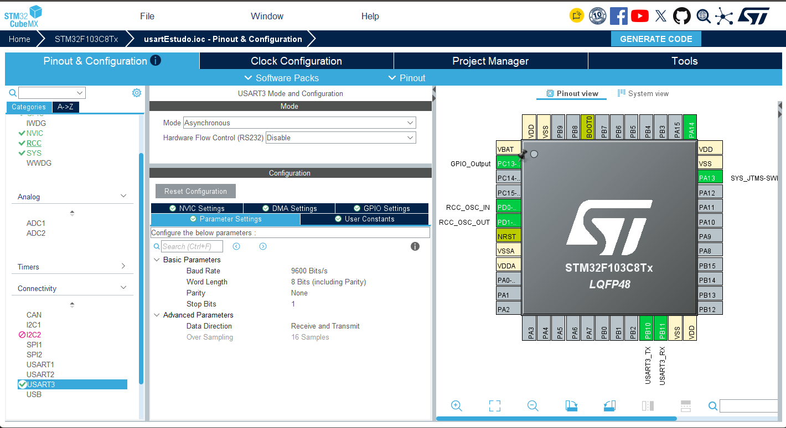

# USART — Leitura do sensor PZEM-004T

## Parte 2 — Configuração do USART3 (Modbus RTU)

## Sobre este manual

**Escopo desta parte:** configuração do USART3 no CubeMX (pinout, modo, parâmetros) e as funções da HAL usadas para transmitir/receber pela USART. O driver Modbus RTU do PZEM-004T (construído sobre essas funções) fica para a próxima parte.

**Projeto de referência:** [Ritesh-9004/stm32-pzem004t](https://github.com/Ritesh-9004/stm32-pzem004t) (licença MIT) — interface STM32F103C8T6 + PZEM-004T v4.0, usada como base para a configuração do USART3 e para a lógica do driver Modbus RTU (`pzem004t.c/.h`), com a devida atribuição ao adaptar o código. O projeto de referência também usa um USART1 dedicado a debug via terminal serial, não adotado aqui.

**Hardware em uso:** STM32F103C8T6 "Blue Pill" + ST-Link V2 + sensor PZEM-004T v4.0 (versão TTL/UART)

## Sobre o PZEM-004T e o protocolo Modbus RTU

**PZEM-004T v4.0:** módulo de medição de energia AC (tensão, corrente, potência, energia acumulada, frequência e fator de potência), com saída serial TTL — diferente das versões anteriores (v1/v2/v3), que usavam um protocolo proprietário simples. A v4.0 fala **Modbus RTU** de verdade.

**Modbus RTU:** protocolo mestre-escravo sobre serial assíncrona. O STM32 (mestre) envia um quadro de requisição contendo endereço do escravo, código de função e CRC16; o PZEM (escravo) responde com os dados solicitados, também com CRC16 para verificação de integridade.

**Function code usado:** `0x04` (Read Input Registers) — lê 10 registradores (endereços `0x0000` a `0x0009`), que trazem tensão, corrente, potência, energia, frequência e fator de potência em sequência.

## Configuração do USART3

**Onde configurar:** CubeMX → Pinout & Configuration → Connectivity → USART3

| Campo | Valor |
| --- | --- |
| Mode | Asynchronous |
| Baud Rate | 9600 Bits/s |
| Word Length | 8 Bits |
| Parity | None |
| Stop Bits | 1 |
| Data Direction | Receive and Transmit |
| Over Sampling | 16 Samples |



**Pinout:** PB10 (USART3_TX) → PZEM RX · PB11 (USART3_RX) ← PZEM TX. Ao marcar Mode = Asynchronous, o CubeMX já ajusta os dois pinos automaticamente (PB10 como Alternate Function Push-Pull, PB11 como Input Floating) — não é preciso configurar o GPIO manualmente.

**NVIC:** o projeto de referência habilita o global interrupt do USART3, mas a leitura do PZEM é feita por polling (`HAL_UART_Receive` com timeout), não por interrupção. Ou seja, o NVIC habilitado ali não é usado pelo driver — pode ser deixado desabilitado nesta parte, a menos que uma versão por interrupção seja implementada depois.

**Por que 9600 e não um baud rate maior:** é o valor fixo de fábrica do PZEM-004T — não é configurável no sensor, então o USART3 precisa casar com ele.

## Uso da USART — funções da HAL

Antes de entrar no driver do PZEM (que fica para a próxima parte), vale entender as duas funções da HAL que fazem a USART3 de fato transmitir e receber bytes — é sobre elas que qualquer driver acima é construído.

### Transmitir — `HAL_UART_Transmit`

```c
HAL_StatusTypeDef HAL_UART_Transmit(UART_HandleTypeDef *huart, uint8_t *pData, uint16_t Size, uint32_t Timeout);
```

```c
uint8_t comando[8] = {0x01, 0x04, 0x00, 0x00, 0x00, 0x0A, 0x70, 0x0D};

HAL_StatusTypeDef status = HAL_UART_Transmit(&huart3, comando, sizeof(comando), 100);

if (status != HAL_OK) {
    // falha ao transmitir (ex.: timeout de 100 ms estourado)
}
```

- `huart3` é o handle gerado pelo CubeMX para o USART3 já configurado.
- `pData`/`Size`: buffer e quantidade de bytes a enviar.
- `Timeout` (ms): tempo máximo de espera até os bytes saírem pelo TX; ultrapassado, retorna `HAL_TIMEOUT`.

### Receber — `HAL_UART_Receive`

```c
HAL_StatusTypeDef HAL_UART_Receive(UART_HandleTypeDef *huart, uint8_t *pData, uint16_t Size, uint32_t Timeout);
```

```c
uint8_t resposta[25];

HAL_StatusTypeDef status = HAL_UART_Receive(&huart3, resposta, sizeof(resposta), 200);

if (status == HAL_OK) {
    // resposta[] contém os Size bytes recebidos dentro do timeout
} else if (status == HAL_TIMEOUT) {
    // não chegaram Size bytes dentro de 200 ms
}
```

**Por que a versão por polling (bloqueante) e não `_IT`/`_DMA` aqui:** para leituras esporádicas — poucas vezes por segundo, como será o caso do PZEM — a chamada bloqueante com timeout é suficiente e mais simples de entender: o código só fica parado pelos poucos milissegundos da resposta. As versões `_IT` (interrupção) e `_DMA` compensam quando é preciso continuar executando outra coisa enquanto se espera a recepção, ou quando o volume de dados é grande.

### O retorno `HAL_StatusTypeDef`

Toda chamada de transmissão/recepção da HAL devolve um desses valores:

| Valor | Significado |
| --- | --- |
| `HAL_OK` | Operação concluída dentro do timeout |
| `HAL_TIMEOUT` | Tempo esgotado antes de completar `Size` bytes |
| `HAL_ERROR` | Erro de hardware (ex.: overrun, framing error) |
| `HAL_BUSY` | Periférico já ocupado com outra transmissão/recepção |

É esse retorno que qualquer driver construído sobre a USART3 — como o do PZEM, na próxima parte — usa para decidir se um quadro de dados foi enviado/recebido com sucesso, antes mesmo de verificar o conteúdo.

