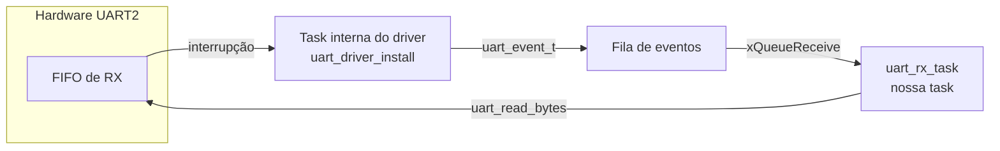

# UART — Recepção do JSON do PZEM (ESP32 lado escravo)

## Parte 1 — Driver UART do ESP-IDF (UART2, fila de eventos)

## Sobre este manual

**Escopo desta parte:** configuração da UART2 no ESP-IDF (`uart_param_config`/`uart_set_pin`/`uart_driver_install`) e a task FreeRTOS que consome a fila de eventos do driver para montar as linhas JSON recebidas. O parsing do JSON (via cJSON) fica para a próxima parte.

**Papel do ESP32 neste sistema:** o STM32 lê o PZEM-004T via Modbus RTU (ver [stm32/pzem](../../stm32/pzem/README.md)) e repassa os dados já formatados como uma linha JSON terminada em `\n`, por uma UART separada, para o ESP32. O ESP32 só recebe e (adiante) publica esses dados — não fala Modbus RTU diretamente.

**Hardware em uso:** ESP32 (módulo DevKit) + STM32F103C8T6 "Blue Pill" (como transmissor)
**Ambiente:** ESP-IDF (`idf.py`) + VS Code

**Projeto de referência:** [esp32_data_pzem](../../../esp32_data_pzem) (pasta irmã deste repositório de docs) — `main/uart_rx.c` / `main/uart_rx.h`.

## Diferença de modelo em relação ao STM32

No STM32 (ver [stm32/02-usart](../../stm32/02-usart/README.md)), a recepção é feita por *polling* bloqueante (`HAL_UART_Receive` com timeout) — o código fica parado esperando os bytes chegarem.

O ESP-IDF resolve isso de outro jeito: `uart_driver_install` cria, por trás dos panos, uma task do driver que atende a interrupção da UART e publica eventos (`uart_event_t`) numa fila (`QueueHandle_t`). A task da aplicação só consome essa fila com `xQueueReceive`, bloqueando sem gastar CPU até haver algo pronto — sem lidar com a interrupção diretamente nem fazer polling.



## Configuração da UART2

**Pinos são livres — matriz de GPIO:** diferente do STM32 (onde cada USART está fisicamente amarrada a pinos específicos, ex.: USART3 = PB10/PB11), o ESP32 tem uma *matriz de GPIO* que permite mapear qualquer periférico UART para praticamente qualquer pino via `uart_set_pin()`. Por isso a UART2 deste projeto não está nos pinos "de fábrica" (GPIO16/17, que são o default da UART1) — está remapeada para GPIO25/26. O número do periférico (`UART_NUM_2`) é independente do pino físico escolhido.

| Parâmetro | Valor | Macro (`uart_rx.h`) |
| --- | --- | --- |
| Periférico | UART2 | `STM32_UART_PORT` = `UART_NUM_2` |
| RX | GPIO26 | `STM32_UART_RX_PIN` |
| TX | GPIO25 | `STM32_UART_TX_PIN` |
| Baud rate | 115200 | `STM32_UART_BAUD` |
| Formato | 8N1 (8 bits, sem paridade, 1 stop bit) | fixo em `uart_config_t` |
| Buffer de RX (ring buffer do driver) | 1024 bytes | `UART_RX_BUF_SIZE` |
| Tamanho da fila de eventos | 10 | `UART_EVENT_QUEUE_LEN` |
| Buffer de linha (JSON montado) | 256 bytes | `UART_LINE_BUF_SIZE` |

```c
uart_config_t uart_config = {
  .baud_rate = STM32_UART_BAUD,
  .data_bits = UART_DATA_8_BITS,
  .parity    = UART_PARITY_DISABLE,
  .stop_bits = UART_STOP_BITS_1,
  .flow_ctrl = UART_HW_FLOWCTRL_DISABLE,
  .source_clk = UART_SCLK_DEFAULT,
};

uart_param_config(STM32_UART_PORT, &uart_config);

uart_set_pin(STM32_UART_PORT,
             STM32_UART_TX_PIN,
             STM32_UART_RX_PIN,
             UART_PIN_NO_CHANGE,   // RTS não usado
             UART_PIN_NO_CHANGE);  // CTS não usado

uart_driver_install(STM32_UART_PORT,
                     UART_RX_BUF_SIZE,
                     0,                     // sem buffer de TX (não usado aqui)
                     UART_EVENT_QUEUE_LEN,
                     &uart_event_queue,
                     0);
```

**Por que 115200 e não 9600 (como no USART3 do STM32 → PZEM):** essa é uma UART diferente, entre STM32 e ESP32, sem relação com o baud fixo de fábrica do PZEM. 115200 foi escolhido livremente para esse enlace.

**Diagnóstico do baud real:** o baud pedido pode divergir ligeiramente do configurado de fato, dependendo do clock disponível. `uart_get_baudrate()` lê de volta o valor real aplicado pelo driver — útil para confirmar que não há arredondamento problemático:

```c
uint32_t actual_baud = 0;
uart_get_baudrate(STM32_UART_PORT, &actual_baud);
ESP_LOGI(TAG, "Baud rate pedido: %d | Baud rate real: %lu", STM32_UART_BAUD, (unsigned long)actual_baud);
```

## Consumindo a fila de eventos

```c
uart_event_t event;
if (xQueueReceive(uart_event_queue, &event, portMAX_DELAY))
{
  switch (event.type)
  {
    case UART_DATA:
      // event.size = quantidade de bytes já disponíveis no buffer do driver
      int len = uart_read_bytes(STM32_UART_PORT, chunk, event.size, 0);
      // ...monta a linha byte a byte até achar '\n'...
      break;
    // outros tipos de evento abaixo
  }
}
```

**`portMAX_DELAY`:** bloqueia indefinidamente até o próximo evento — a task não consome CPU enquanto não há dados, equivalente em espírito ao timeout do `HAL_UART_Receive`, mas sem polling.

**Timeout `0` no `uart_read_bytes`:** quando o evento `UART_DATA` é entregue, os `event.size` bytes já estão garantidamente no ring buffer do driver (é por isso que o evento foi gerado) — um timeout positivo aqui só atrasaria o processamento sem necessidade.

**Montagem de linha:** a task acumula bytes num buffer até encontrar `\n`, no mesmo padrão usado do lado do STM32 ao montar o frame — só então a linha completa (o JSON) é processada.

## Outros eventos da fila — por que tratá-los

A fila de eventos não entrega só `UART_DATA`. Os outros tipos sinalizam problemas na camada física ou no buffer, e ignorá-los (deixando cair no `default`) esconde a causa real de uma leitura corrompida:

| Evento | Significado | Ação tomada |
| --- | --- | --- |
| `UART_FIFO_OVF` | Hardware FIFO estourou — a task não consumiu rápido o suficiente | `uart_flush_input` + `xQueueReset` |
| `UART_BUFFER_FULL` | Ring buffer do driver (os 1024 bytes do `UART_RX_BUF_SIZE`) estourou | `uart_flush_input` + `xQueueReset` |
| `UART_BREAK` | Linha ficou em nível baixo por mais tempo que um frame — não é dado, é sinal elétrico (ver seção de troubleshooting) | Descarta a linha em montagem |
| `UART_FRAME_ERR` | Frame recebido não bate com o formato esperado (8N1) | Descarta a linha em montagem |
| `UART_PARITY_ERR` | Erro de paridade (não deveria ocorrer aqui, paridade está desabilitada) | Descarta a linha em montagem |

## Troubleshooting real — pinos e ruído de linha

Registro de um problema de hardware encontrado e resolvido durante o desenvolvimento deste projeto, porque o sintoma é instrutivo para depurar qualquer UART.

**Sintoma inicial:** dados chegando corrompidos (bytes de lixo misturados no meio do JSON válido). Depois de uma tentativa de ajuste, passou a não chegar nenhum dado.

**Pinos testados:** GPIO16/17 (default da UART1) → corrupção pesada, com rajadas de dezenas de eventos `UART_BREAK` em poucos milissegundos. GPIO26/25 → funcionou limpo.

**Hipótese para GPIO16/17:** em módulos **ESP32-WROVER** (com PSRAM), esses dois pinos ficam internamente ligados ao chip de PSRAM — mesmo com `CONFIG_SPIRAM` desabilitado no `sdkconfig`, a trilha física continua lá, o que pode gerar exatamente esse padrão de ruído/conflito ao usá-los para outro periférico. Em módulos **WROOM** (sem PSRAM), esses pinos são de uso geral e não deveriam ter esse problema. Não confirmado qual módulo é este projeto — fica como item a verificar (a serigrafia do módulo metálico identifica a variante).

**Checklist geral para esse padrão de sintoma** (lixo intercalado com dados válidos + rajada de `UART_BREAK`/`UART_FRAME_ERR`), válido além do caso específico de pino:

1. **GND comum** entre os dois dispositivos — causa mais frequente.
2. **Nível de tensão compatível** — ESP32 não é tolerante a 5V no RX; se o transmissor for 5V, precisa de divisor resistivo ou level shifter.
3. **Fiação física confiável** — contato intermitente em protoboard produz exatamente rajadas de `UART_BREAK`.
4. **Baud rate e formato (8N1) idênticos** nos dois lados.
5. Só depois disso, suspeitar de conflito de pino (caso de módulos com PSRAM acima).

## Próximo passo

Parsing do JSON recebido com cJSON, substituindo o `ESP_LOGI` que hoje só imprime a linha recebida.
