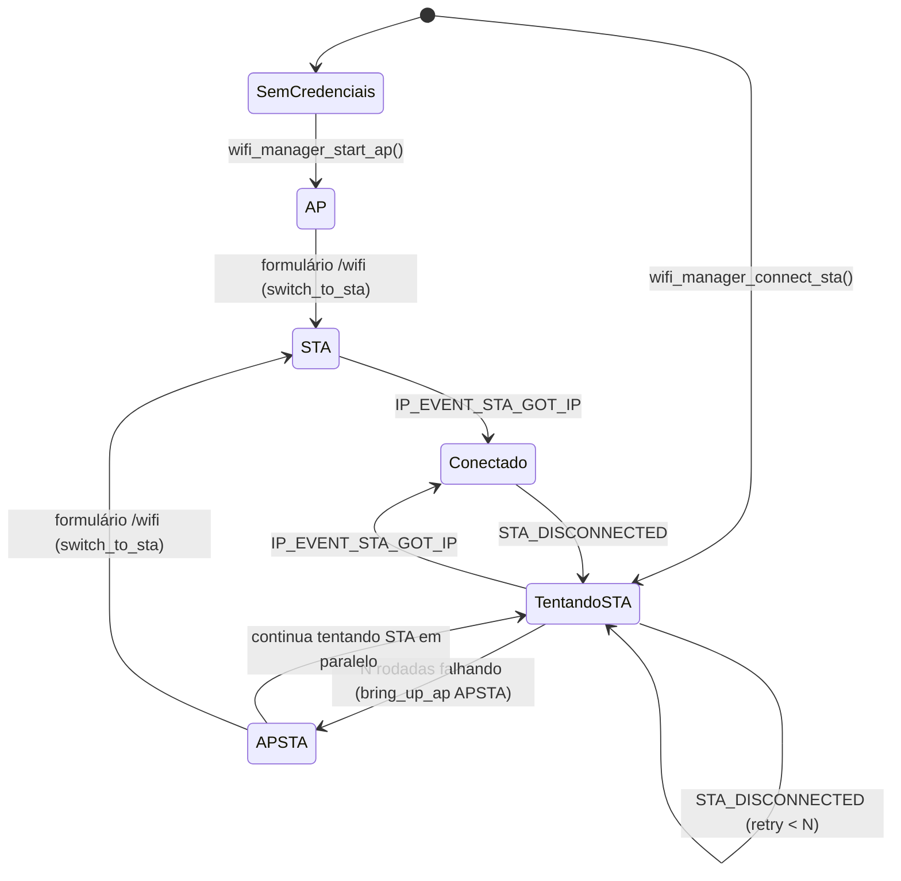

# ESP-IDF: Wi-Fi em modo duplo (STA + AP de configuração) — guia de referência

## Resumo

Este guia estende o [Wi-Fi manager em modo estação](../02-wifi-manager/README.md) com um segundo papel: quando a conexão STA falha repetidamente (ou não há credenciais salvas), o ESP32 sobe um **AP de configuração** em paralelo (modo APSTA), serve um formulário de Wi-Fi (ver [guia 06, servidor HTTP](../06-http-server/README.md)) e troca para a rede nova sem reiniciar o dispositivo.

| Item | Valor validado |
| --- | --- |
| Chip | ESP32 clássico (módulo WROOM-32) |
| ESP-IDF | v6.0.2 |
| Modos | STA (DHCP), AP (fixo via Kconfig), APSTA (os dois ao mesmo tempo) |
| Persistência de credenciais | NVS, namespace próprio (`wifi_creds`) |
| Critério de fallback | N rodadas de reconexão falhando seguidas (`CONFIG_WIFI_AP_FALLBACK_ROUNDS`) |
| Troca de rede | Sem reboot — `esp_wifi_set_mode()` em tempo de execução |

Use este padrão sempre que o dispositivo for instalado num local sem acesso físico fácil (campo, quadro elétrico) e precisar trocar de rede Wi-Fi sem reflash. Se o SSID/senha nunca mudam depois de instalados, o guia 02 (STA puro, credenciais fixas no `menuconfig`) já basta e é mais simples.

O que está marcado como "validado" veio de um projeto real, incluindo dois problemas encontrados e corrigidos ao vivo durante a migração deste código para um novo projeto (ver Problemas comuns); o restante vem da documentação oficial listada em Fontes, no fim.

## Pré-requisitos

### Kconfig

```
menu "AP de configuração (Wi-Fi)"

    config WIFI_AP_SSID
        string "SSID do AP de configuração"
        default "PZEM-Config"

    config WIFI_AP_PASSWORD
        string "Senha do AP de configuração"
        default "pzem1234"
        help
            Minimo de 8 caracteres para WPA2-PSK. Deixar vazio sobe o AP
            sem senha (aberto).

    config WIFI_AP_FALLBACK_ROUNDS
        int "Rodadas falhando até subir o AP"
        default 3
        range 1 20

endmenu
```

**Atenção:** o código (`wifi_manager.c`) referencia `CONFIG_WIFI_AP_SSID`, `CONFIG_WIFI_AP_PASSWORD` e `CONFIG_WIFI_AP_FALLBACK_ROUNDS` diretamente — se esse menu não existir em `Kconfig.projbuild`, o build falha com "identificador não declarado" na hora de compilar `wifi_manager.c`, não no link. Isso aconteceu de fato ao reaproveitar este módulo num projeto novo (ver Problemas comuns).

### CMake

```cmake
idf_component_register(SRCS "main.c" "wifi_manager.c" "wifi_creds.c"
                    INCLUDE_DIRS "."
                    REQUIRES esp_wifi esp_event esp_netif nvs_flash esp_timer)
```

Mesma lista do guia 02 — o modo AP usa os mesmos componentes do modo STA, só muda a configuração do driver.

### NVS e event loop

Os mesmos pré-requisitos do guia 02 (`nvs_flash_init()` antes do Wi-Fi, event loop padrão criado uma única vez no programa) se aplicam aqui.

## Arquitetura

O radio Wi-Fi tem três modos possíveis, e o módulo transita entre eles conforme o resultado das tentativas de conexão e da ação do usuário pelo formulário web.



| Parte | Papel |
| --- | --- |
| `s_sta_enabled` | Liga quando devemos tentar/manter STA; `false` durante o AP puro inicial |
| `s_ap_active` | AP ligado agora (sozinho ou junto com STA) |
| `s_failed_rounds` | Rodadas de reconexão falhando seguidas; zera só no `GOT_IP` |
| `bring_up_ap(modo)` | Sobe o AP com `WIFI_MODE_AP` (puro) ou `WIFI_MODE_APSTA` (junto com STA tentando) |
| `tear_down_ap()` | Desliga o AP e volta pro modo `WIFI_MODE_STA` puro |
| `try_connect_sta()` | Aplica as credenciais atuais e chama `esp_wifi_connect()` |
| Callbacks de ciclo de vida | `wifi_manager_set_ap_lifecycle_cb(on_start, on_stop)` — opcional, para quem quiser reagir à subida/queda do AP (ex: LED) |

## Inicialização

Diferente do guia 02 (que cria só a netif STA), aqui as duas interfaces de rede são criadas desde o início, mesmo que o AP só suba depois:

```c
void wifi_manager_init(void)
{
    s_wifi_event_group = xEventGroupCreate();

    esp_netif_init();
    esp_event_loop_create_default();

    esp_netif_create_default_wifi_sta();
    esp_netif_create_default_wifi_ap();   // criada mesmo que o AP nunca suba

    wifi_init_config_t cfg = WIFI_INIT_CONFIG_DEFAULT();
    esp_wifi_init(&cfg);

    esp_event_handler_register(WIFI_EVENT, ESP_EVENT_ANY_ID, &wifi_event_handler, NULL);
    esp_event_handler_register(IP_EVENT, IP_EVENT_STA_GOT_IP, &wifi_event_handler, NULL);
}
```

No `app_main`, a decisão entre conectar em STA ou subir o AP vem de haver ou não credenciais salvas:

```c
char ssid[WIFI_CREDS_SSID_MAX_LEN + 1];
char password[WIFI_CREDS_PASSWORD_MAX_LEN + 1];

if (wifi_creds_load(ssid, sizeof(ssid), password, sizeof(password))) {
    wifi_manager_connect_sta(ssid, password);
} else {
    wifi_manager_start_ap();
}
```

## Subir e derrubar o AP

```c
static void bring_up_ap(wifi_mode_t mode)
{
    if (s_ap_active) {
        return;
    }

    wifi_config_t ap_config = {
        .ap = {
            .ssid_len = strlen(CONFIG_WIFI_AP_SSID),
            .channel = 1,
            .max_connection = 4,
            .authmode = WIFI_AUTH_WPA2_PSK,
        },
    };
    strncpy((char *)ap_config.ap.ssid, CONFIG_WIFI_AP_SSID, sizeof(ap_config.ap.ssid) - 1);
    strncpy((char *)ap_config.ap.password, CONFIG_WIFI_AP_PASSWORD, sizeof(ap_config.ap.password) - 1);

    if (strlen(CONFIG_WIFI_AP_PASSWORD) == 0) {
        ap_config.ap.authmode = WIFI_AUTH_OPEN;   // sem senha: AP aberto
    }

    esp_wifi_set_mode(mode);                // WIFI_MODE_AP ou WIFI_MODE_APSTA
    esp_wifi_set_config(WIFI_IF_AP, &ap_config);

    if (!s_wifi_started) {
        esp_wifi_start();                   // só na primeira vez
        s_wifi_started = true;
    }

    s_ap_active = true;
}

static void tear_down_ap(void)
{
    if (!s_ap_active) {
        return;
    }
    s_ap_active = false;
    esp_wifi_set_mode(WIFI_MODE_STA);       // sem reiniciar o driver
}
```

**Por que `esp_wifi_start()` só roda uma vez:** trocar de modo (`esp_wifi_set_mode`) com o driver já iniciado não exige pará-lo e reiniciar — é por isso que a troca AP↔STA não derruba a stack Wi-Fi inteira nem exige reboot.

## Fallback automático: contagem de rodadas

```c
static void wifi_event_handler(void *arg, esp_event_base_t event_base,
                                int32_t event_id, void *event_data)
{
    if (event_base == WIFI_EVENT && event_id == WIFI_EVENT_STA_DISCONNECTED) {
        xEventGroupClearBits(s_wifi_event_group, WIFI_CONNECTED_BIT);

        if (!s_sta_enabled) {
            return;   // desconexão esperada (ex: estamos trocando de rede)
        }

        s_retry_count++;
        if (s_retry_count >= WIFI_RETRIES_PER_ROUND) {
            s_retry_count = 0;
            s_failed_rounds++;

            if (s_failed_rounds >= CONFIG_WIFI_AP_FALLBACK_ROUNDS && !s_ap_active) {
                bring_up_ap(WIFI_MODE_APSTA);   // sobe o AP SEM desistir do STA
            }
        }
        start_reconnect_timer();
    } else if (event_base == IP_EVENT && event_id == IP_EVENT_STA_GOT_IP) {
        s_retry_count = 0;
        s_failed_rounds = 0;
        xEventGroupSetBits(s_wifi_event_group, WIFI_CONNECTED_BIT);
    }
}
```

O AP sobe em **APSTA**, não substituindo o STA: o dispositivo continua tentando a rede salva em segundo plano, e se ela voltar a responder, `GOT_IP` chega normalmente sem precisar mexer no AP.

## Trocar de rede pelo formulário web

A função que o handler HTTP do formulário `/wifi` chama (ver guia 06) depois de validar o SSID:

```c
void wifi_manager_switch_to_sta(const char *ssid, const char *password)
{
    wifi_creds_save(ssid, password ? password : "");   // salva ANTES de trocar
    tear_down_ap();

    strncpy(s_sta_ssid, ssid, sizeof(s_sta_ssid) - 1);
    strncpy(s_sta_password, password ? password : "", sizeof(s_sta_password) - 1);

    s_sta_enabled = true;
    s_retry_count = 0;
    s_failed_rounds = 0;

    try_connect_sta();
}
```

**Por que salvar antes de trocar:** se a troca falhar (senha errada, rede fora de alcance), as credenciais novas já ficam persistidas — na próxima tentativa (ou no próximo boot) o dispositivo já tenta a rede nova, em vez de voltar pra uma rede antiga que o usuário queria abandonar.

### Persistir credenciais pequenas em NVS

O módulo `wifi_creds.c/h` é o exemplo deste projeto do padrão "guardar um punhado de campos fixos e pequenos na NVS, com um namespace próprio":

```c
bool wifi_creds_load(char *ssid, size_t ssid_len, char *password, size_t password_len)
{
    nvs_handle_t handle;
    if (nvs_open("wifi_creds", NVS_READONLY, &handle) != ESP_OK) {
        return false;
    }

    size_t ssid_size = ssid_len, pass_size = password_len;
    esp_err_t err_ssid = nvs_get_str(handle, "ssid", ssid, &ssid_size);
    esp_err_t err_pass = nvs_get_str(handle, "password", password, &pass_size);
    nvs_close(handle);

    return err_ssid == ESP_OK && err_pass == ESP_OK;
}

bool wifi_creds_save(const char *ssid, const char *password)
{
    nvs_handle_t handle;
    if (nvs_open("wifi_creds", NVS_READWRITE, &handle) != ESP_OK) {
        return false;
    }
    nvs_set_str(handle, "ssid", ssid);
    nvs_set_str(handle, "password", password);
    esp_err_t err = nvs_commit(handle);
    nvs_close(handle);
    return err == ESP_OK;
}
```

Esse é o padrão certo quando os campos são conhecidos e fixos (aqui, só SSID e senha). Quando o conjunto de chaves varia ou cresce com o tempo (por exemplo, configurações expostas numa página web), o padrão genérico de key/value do [guia 07](../07-nvs-settings-store/README.md) evita criar uma função nova a cada campo novo.

## Problemas comuns

| Sintoma | Causa provável | Ação |
| --- | --- | --- |
| Build falha compilando `wifi_manager.c` com "use of undeclared identifier 'CONFIG_WIFI_AP_SSID'" (ou `_PASSWORD`/`_FALLBACK_ROUNDS`) | O menu do AP não existe em `Kconfig.projbuild` — aconteceu de fato ao migrar este módulo para outro projeto sem copiar o Kconfig junto | Adicionar o menu "AP de configuração" mostrado em Pré-requisitos |
| O navegador/celular perde a conexão assim que o Wi-Fi é configurado pelo formulário | Comportamento esperado: `tear_down_ap()` desliga o AP, e quem estava conectado a ele (inclusive o celular usado para configurar) perde a rede do próprio dispositivo | Reconectar o celular/PC à rede de destino (a mesma que o ESP32 acabou de entrar) antes de tentar acessar o painel pelo novo IP |
| O dispositivo nunca sobe o AP mesmo sem rede | `CONFIG_WIFI_AP_FALLBACK_ROUNDS` alto demais para o tempo de teste, ou `s_ap_active` preso em `true` de um estado anterior | Reduzir o número de rodadas para testar, ou conferir o log de `WIFI_EVENT_STA_DISCONNECTED` |
| Credenciais novas não "pegam" depois de salvar | `try_connect_sta()` chamado antes de `tear_down_ap()` trocar o modo de volta pra STA | Confirmar a ordem: salvar → derrubar AP → aplicar config STA → conectar |
| AP sobe sem senha mesmo com `WIFI_AP_PASSWORD` preenchido | Senha com menos de 8 caracteres (mínimo do WPA2-PSK) — o driver pode rejeitar a config | Usar senha com 8+ caracteres, ou aceitar o AP aberto para senhas vazias/curtas |

## Checklist para reaproveitar

- [ ] Copiar o menu Kconfig do AP junto com `wifi_manager.c/h` — o código não compila sem ele
- [ ] Criar as duas netifs (`_sta()` e `_ap()`) no `wifi_manager_init()`, mesmo que o AP só suba depois
- [ ] Decidir o critério de fallback (`CONFIG_WIFI_AP_FALLBACK_ROUNDS`) a partir do tempo real que a rede alvo leva pra cair e voltar
- [ ] Salvar as credenciais novas antes de derrubar o AP e tentar a conexão
- [ ] Avisar o usuário (na página de confirmação) que o dispositivo dele vai perder a rede do AP
- [ ] Testar os três caminhos: primeiro boot sem credenciais (sobe AP), reconexão falhando N vezes (sobe APSTA), troca de rede pelo formulário (AP cai, STA conecta)

### Fontes

- [ESP-IDF Wi-Fi API](https://docs.espressif.com/projects/esp-idf/en/latest/esp32/api-reference/network/esp_wifi.html): modos `WIFI_MODE_AP`/`WIFI_MODE_APSTA`, `esp_wifi_set_mode()` em tempo de execução.
- [NVS API do ESP-IDF](https://docs.espressif.com/projects/esp-idf/en/latest/esp32/api-reference/storage/nvs_flash.html): `nvs_open`/`nvs_get_str`/`nvs_set_str`, usados por `wifi_creds`.
- O restante (máquina de estados STA/AP/APSTA, contagem de rodadas, troca sem reboot) é o desenho deste projeto, validado em hardware real nesta sessão, não uma receita oficial da Espressif.
