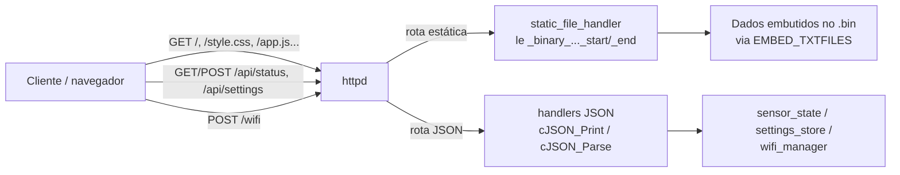

# ESP-IDF: servidor HTTP embarcado (painel web + API JSON) — guia de referência

## Resumo

Este guia monta um servidor HTTP no ESP32 com `esp_http_server`: páginas estáticas (HTML/CSS/JS) embutidas no firmware via `EMBED_TXTFILES`, e endpoints JSON (GET/POST) na mesma tabela de rotas. Inclui dois problemas reais — não óbvios e mal documentados — encontrados depurando este exato código ao vivo.

| Item | Valor validado |
| --- | --- |
| Chip | ESP32 clássico (módulo WROOM-32) |
| ESP-IDF | v6.0.2 |
| Servidor | `esp_http_server` (`httpd_start`/`httpd_register_uri_handler`) |
| Arquivos estáticos | `EMBED_TXTFILES` (HTML/CSS/JS) |
| Formato das respostas JSON | `cJSON` |
| Depende de | [Wi-Fi AP+STA](../05-wifi-ap-sta/README.md) (opcional — o servidor sobe independente do modo Wi-Fi) e [settings_store](../07-nvs-settings-store/README.md) (opcional — configurações editáveis) |

Use este padrão quando o dispositivo precisar de uma interface de configuração/diagnóstico local, sem depender de um servidor externo. O servidor fica no ar o tempo todo, inclusive com o AP de configuração ativo — é o canal usado para configurar o Wi-Fi em primeiro lugar.

## Pré-requisitos

### CMake

```cmake
idf_component_register(SRCS "main.c" "web_ui.c"
                    INCLUDE_DIRS "."
                    EMBED_TXTFILES "web/index.html" "web/style.css" "web/app.js"
                                   "web/wifi.html" "web/wifi_saved.html" "web/settings.html"
                    REQUIRES esp_http_server cjson)
```

`EMBED_TXTFILES` recebe caminhos relativos ao diretório do componente (`main/`) — os arquivos precisam existir em disco em `main/web/`.

## Arquitetura



| Parte | Papel |
| --- | --- |
| `httpd_config_t` | Configuração do servidor; `max_uri_handlers` precisa cobrir o total de rotas registradas |
| `httpd_uri_t[]` | Tabela declarativa de rotas — mesma URI pode aparecer duas vezes, uma por método (GET/POST) |
| `static_file_handler` | Um handler genérico para todas as rotas de arquivo, parametrizado por `req->user_ctx` |
| Símbolos `_binary_..._start/_end` | Gerados pelo build a partir de `EMBED_TXTFILES`, apontam para o conteúdo do arquivo embutido no `.bin` |
| Handlers JSON | Montam (`cJSON_Print`) ou consomem (`cJSON_Parse`) o corpo da requisição |

## Servindo arquivos estáticos embutidos

```c
extern const char web_index_html_start[] asm("_binary_index_html_start");
extern const char web_index_html_end[]   asm("_binary_index_html_end");

typedef struct {
    const char *start;
    const char *end;
    const char *content_type;
} static_asset_t;

static const static_asset_t asset_index = { web_index_html_start, web_index_html_end, "text/html" };

static esp_err_t static_file_handler(httpd_req_t *req)
{
    const static_asset_t *asset = (const static_asset_t *)req->user_ctx;
    size_t len = asset->end - asset->start;

    // Ver "Problema 2" abaixo — sem isto, app.js quebra no navegador
    if (len > 0 && asset->start[len - 1] == '\0') {
        len--;
    }

    httpd_resp_set_type(req, asset->content_type);
    httpd_resp_send(req, asset->start, len);
    return ESP_OK;
}
```

### Problema 1 — o nome do símbolo não inclui o diretório

A convenção amplamente repetida (inclusive em exemplos e comentários de código) é "`/` no caminho vira `_` no nome do símbolo" — ou seja, `web/index.html` deveria gerar `_binary_web_index_html_start`. **Isso não bateu nesta versão do ESP-IDF (v6.0.2):** o build gerou `_binary_index_html_start`, usando só o nome do arquivo, sem o diretório. O sintoma foi erro de link:

```
undefined reference to `_binary_web_index_html_start'
```

mesmo com o `.obj` do arquivo existindo e aparecendo dentro da biblioteca do componente. A forma de confirmar o nome real do símbolo, em vez de assumir a convenção, é inspecionar o `.obj` gerado:

```bash
xtensa-esp32-elf-nm build/esp-idf/main/CMakeFiles/__idf_main.dir/__/__/index.html.S.obj
# 00000000 R _binary_index_html_start
# 000004c1 R _binary_index_html_end
```

**Não assuma o nome do símbolo a partir do caminho — confira com `nm` no `.obj` real antes de escrever os `extern`.**

### Problema 2 — byte nulo extra no final de cada arquivo

`EMBED_TXTFILES` (diferente de `EMBED_FILES`) adiciona um `'\0'` depois do conteúdo de cada arquivo, para que ele possa ser tratado como string C diretamente. Isso significa que `end - start` é **um byte maior** que o tamanho real do arquivo (confirmado comparando `wc -c` do arquivo fonte com `end - start` do símbolo gerado).

Em HTML e CSS, esse byte nulo extra no fim do corpo da resposta HTTP não tem efeito visível — o navegador ignora. Em um arquivo `.js`, porém, esse `\0` sobrando faz o parser JavaScript lançar um erro de sintaxe, **abortando a execução do arquivo inteiro, sem nenhum erro visível na página** — só no console do navegador (F12), e mesmo assim como um erro genérico de parsing. O sintoma no produto foi: nenhuma parte dinâmica da página funcionava (nem o painel de status, nem o formulário de configurações), mas o HTML e o CSS estáticos sempre renderizavam normalmente — porque só o JS quebrava.

A correção é descontar o terminador antes de enviar, como no código acima (`if (... asset->start[len-1] == '\0') len--;`), condicional para não cortar um caractere de verdade caso o comportamento mude em outra versão do ESP-IDF.

## Rotas JSON

```c
static esp_err_t api_status_handler(httpd_req_t *req)
{
    cJSON *root = cJSON_CreateObject();
    cJSON_AddBoolToObject(root, "wifi_connected", wifi_manager_is_connected());

    char *json = cJSON_PrintUnformatted(root);
    httpd_resp_set_type(req, "application/json");
    httpd_resp_sendstr(req, json);

    free(json);          // cJSON_PrintUnformatted aloca — sempre libere
    cJSON_Delete(root);
    return ESP_OK;
}

static esp_err_t api_settings_post_handler(httpd_req_t *req)
{
    char buf[256];
    int len = httpd_req_recv(req, buf, sizeof(buf) - 1);
    if (len <= 0) {
        httpd_resp_send_err(req, HTTPD_400_BAD_REQUEST, "corpo vazio");
        return ESP_FAIL;
    }
    buf[len] = '\0';

    cJSON *root = cJSON_Parse(buf);
    // ...valida e usa root...
    cJSON_Delete(root);

    httpd_resp_sendstr(req, "{\"ok\":true}");
    return ESP_OK;
}
```

`httpd_req_recv` não garante que o corpo inteiro chegue numa chamada só para corpos maiores que o buffer — para payloads pequenos (formulários, JSON de configuração), um buffer com folga e uma única chamada bastam; para upload de arquivo grande, seria necessário um loop.

### Mesma URI, métodos diferentes

```c
static const httpd_uri_t routes[] = {
    { .uri = "/api/settings", .method = HTTP_GET,  .handler = api_settings_get_handler },
    { .uri = "/api/settings", .method = HTTP_POST, .handler = api_settings_post_handler },
};
```

`esp_http_server` despacha por URI **e** método juntos — registrar a mesma URI duas vezes, uma por método, é o padrão suportado, não uma colisão.

### Formulário simples (sem JSON)

Para um formulário HTML tradicional (`<form method="POST">`), o corpo chega como `application/x-www-form-urlencoded` (`campo=valor&outro=valor2`), não JSON — um decodificador mínimo resolve:

```c
static void url_decode(char *dst, const char *src, size_t dst_len)
{
    size_t j = 0;
    for (size_t i = 0; src[i] != '\0' && j + 1 < dst_len; i++) {
        if (src[i] == '+') {
            dst[j++] = ' ';
        } else if (src[i] == '%' && src[i + 1] && src[i + 2]) {
            char hex[3] = { src[i + 1], src[i + 2], '\0' };
            dst[j++] = (char)strtol(hex, NULL, 16);
            i += 2;
        } else {
            dst[j++] = src[i];
        }
    }
    dst[j] = '\0';
}
```

Suficiente para SSID/senha e campos de texto comuns; não cobre todos os casos de um decodificador de formulário genérico.

## Configuração

| Parâmetro | Em quê | Observação |
| --- | --- | --- |
| `max_uri_handlers` | `httpd_config_t` | Padrão da macro `HTTPD_DEFAULT_CONFIG()` é 8; aumente se a tabela de rotas passar disso |
| Content-Type por asset | Tabela `static_asset_t` | Acertar `text/html`, `text/css`, `application/javascript` — um tipo errado pode fazer o navegador não interpretar o arquivo como esperado |
| Tamanho do buffer de `httpd_req_recv` | Handlers POST | Precisa cobrir o maior corpo esperado; corpo maior que o buffer exige ler em loop |

## Configuração editável via settings_store

O endpoint `/api/settings` (GET lista, POST salva) é uma camada fina sobre o key/value genérico em NVS descrito no [guia 07](../07-nvs-settings-store/README.md) — o handler só traduz entre JSON e `settings_get_string`/`settings_set_string`, sem conhecer onde o valor é persistido.

## Problemas comuns

| Sintoma | Causa provável | Ação |
| --- | --- | --- |
| Link falha com `undefined reference to _binary_..._start/_end` | Nome do símbolo assumido pela convenção "caminho vira `_`", mas esta versão do ESP-IDF usa só o nome do arquivo | Inspecionar o `.obj` real com `xtensa-esp32-elf-nm` (ver Problema 1) e ajustar os `extern asm(...)` |
| Nenhuma parte dinâmica da página funciona (fetch nunca atualiza nada), mas o HTML/CSS renderiza normal | Byte nulo extra do `EMBED_TXTFILES` quebrando o parser do `.js` no navegador | Descontar 1 do tamanho ao servir, se o último byte for `'\0'` (ver Problema 2) |
| `httpd_start` falha silenciosamente / rotas somem | `max_uri_handlers` menor que o número de rotas registradas | Aumentar `config.max_uri_handlers` antes de `httpd_start` |
| POST retorna 400 mesmo com corpo aparentemente certo | Corpo maior que o buffer de `httpd_req_recv`, ou `Content-Length` não bate | Aumentar o buffer, ou tratar o recv em loop para corpos grandes |
| `cJSON_Parse` retorna `NULL` sem motivo aparente | Corpo não terminado em `'\0'` antes do parse (`httpd_req_recv` não garante isso) | Sempre `buf[len] = '\0';` depois do `recv`, antes de `cJSON_Parse` |
| Vazamento de memória lento ao longo do tempo | `cJSON_PrintUnformatted` aloca e o `free()` foi esquecido | Conferir `free(json)` depois de todo `httpd_resp_sendstr(req, json)` com string vinda do cJSON |

## Checklist para reaproveitar

- [ ] Declarar `esp_http_server` e `cjson` no `REQUIRES`, e os arquivos em `EMBED_TXTFILES`
- [ ] Depois do primeiro build, conferir com `nm` o nome real dos símbolos `_binary_..._start/_end` — não assumir pela convenção do caminho
- [ ] Descontar o terminador nulo do tamanho ao servir arquivos de texto embutidos, especialmente `.js`
- [ ] Dimensionar `max_uri_handlers` para o total de rotas (incluindo URIs repetidas com métodos diferentes)
- [ ] Sempre `buf[len] = '\0'` depois de `httpd_req_recv`, antes de qualquer parse
- [ ] Liberar toda string retornada por `cJSON_Print*` com `free()`, além do `cJSON_Delete` da árvore

### Fontes

- [ESP HTTP Server](https://docs.espressif.com/projects/esp-idf/en/latest/esp32/api-reference/protocols/esp_http_server.html): `httpd_uri_t`, registro de múltiplos handlers por URI, `httpd_req_recv`.
- [Build System — EMBED_FILES / EMBED_TXTFILES](https://docs.espressif.com/projects/esp-idf/en/latest/esp32/api-guides/build-system.html): mecanismo de embutir arquivos como dados binários.
- O nome exato do símbolo gerado (sem o diretório) e o byte nulo extra do `EMBED_TXTFILES` foram confirmados inspecionando o `.obj` real desta versão (v6.0.2) com `xtensa-esp32-elf-nm`, não a documentação oficial — não foi encontrada uma página que descreva esse detalhe explicitamente.
