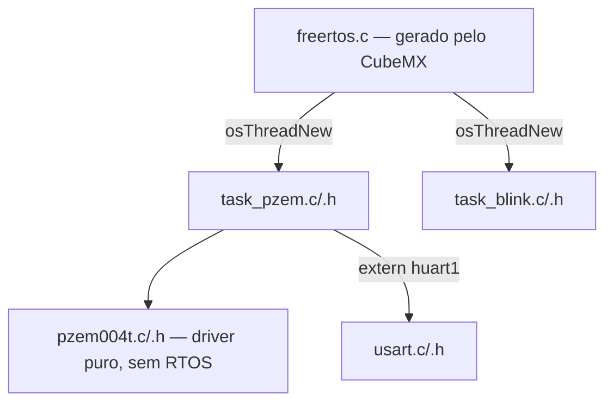

# PZEM-004T — Especificação, Driver e Integração FreeRTOS

Comunicação Modbus-RTU entre STM32F103C8T6 (Blue Pill) e PZEM-004T v3.0 validada com dados reais de rede elétrica, migrada para uma task dedicada do FreeRTOS (CMSIS-RTOS v2). Leitura periódica (1s), não-bloqueante para o restante do sistema.

**Primeira leitura real validada:**

| Grandeza | Valor lido |
| --- | --- |
| Tensão | 124.8 V |
| Corrente | 0.336 A |
| Potência | 42 W |
| Energia | 0.2 Wh |
| Frequência | 60 Hz |
| Fator de potência | 1 |

Valores consistentes com rede monofásica 127V/60Hz e carga resistiva.

**Status:** driver funcional, integrado ao FreeRTOS, pronto para expansão (múltiplas instâncias, envio para fila central de dados).

## Especificação técnica

**Camada física:** UART TTL direto no STM32 (sem conversor RS485). Baud rate 9600, 8 bits de dados, 1 stop bit, sem paridade.

**Camada de aplicação:** Modbus-RTU. Códigos de função suportados: 0x03 (Read Holding Register), 0x04 (Read Input Register), 0x06 (Write Single Register), 0x41 (calibração, uso interno), 0x42 (reset de energia).

## Mapa de registradores Modbus

> **Nota de versão:** a tabela abaixo referencia PZEM-004T **v4.0**. O módulo em uso neste projeto é a **v3.0** — confirmar se o mapa de endereços é idêntico antes de usar estes registradores diretamente; a v3.0 pode ter offsets diferentes. Validar contra o datasheet correspondente à versão física do módulo.

**Protocolo:** Modbus RTU sobre UART — Baud rate 9600, formato 8N1 (8 bits de dados, sem paridade, 1 stop bit), CRC16-Modbus (polinomial 0xA001)

| Registrador | Parâmetro | Unidade | Formato |
| --- | --- | --- | --- |
| 0x0000 | Voltage | 0.1V | uint16 |
| 0x0001-2 | Current | 0.001A | uint32 |
| 0x0003-4 | Power | 0.1W | uint32 |
| 0x0005-6 | Energy | 1Wh | uint32 |
| 0x0007 | Frequency | 0.1Hz | uint16 |
| 0x0008 | Power Factor | 0.01 | uint16 |
| 0x0009 | Alarm Status | - | uint16 |


## Ligação física

| PZEM (lado TTL) | Blue Pill | Observação |
| --- | --- | --- |
| VCC | Fonte externa 3.3V  |  |
| GND | GND | Comum entre os dois |
| RX | PA9 (USART1\_TX) |  |
| TX | PA10 (USART1\_RX)  |  |

**Nota de segurança:** o PZEM só opera (responde ao Modbus) quando conectado à rede elétrica (L/N) — alimentação apenas nos pinos TTL não é suficiente. O lado AC do módulo carrega tensão letal: nunca conectar ao circuito de baixa tensão, desenergizar antes de manusear. Verificar isolamento físico completo entre os terminais L/N e qualquer fio do lado TTL antes de energizar.

## Driver — base e adaptações

**Fonte:** [github.com/Ritesh-9004/stm32-pzem004t](https://github.com/Ritesh-9004/stm32-pzem004t) — driver HAL para STM32F103C8T6 + PZEM-004T via Modbus-RTU.

**Reaproveitado:** cálculo de CRC16-Modbus (polinômio 0xA001), montagem do frame de leitura (função 0x04), mapa de registradores e lógica de parsing dos valores (tensão, corrente, potência, energia, frequência, fator de potência) — testado e validado pelo autor original.

**Arquivos do driver: usados sem nenhuma alteração em relação ao repositório original** (`pzem004t.h` / `pzem004t.c` copiados exatamente como estão). O driver é genérico via ponteiro (`UART_HandleTypeDef *huart`), então a USART e o endereço Modbus são parâmetros de chamada, não código a editar — toda a adaptação ao projeto acontece na camada de aplicação (`task_pzem.c`), não no driver:

```c
PZEM_Init(&pzem, &huart3, PZEM_ADDR);  // USART1 e endereço 0xF8 passados como parâmetros
```

## Configuração FreeRTOS

**Middleware:** FREERTOS ativado no CubeMX, Interface: **CMSIS\_V2**

**Tasks criadas:**

| Task | Prioridade | Stack (words) | Entry function | Responsabilidade |
| --- | --- | --- | --- | --- |
| pzemReadTask | osPriorityNormal | 256 | StartPZEMTask | Leitura periódica do PZEM via Modbus-RTU |
| blinkLedTask | osPriorityLow | 128 | StartBlinkTask | Sinalização visual (heartbeat do sistema) |

**Justificativa das prioridades:** leitura de sensor é funcionalmente mais importante que o blink (puramente cosmético/diagnóstico), por isso Normal > Low.

**Justificativa do stack size:** 256 words (1024 bytes) na task do PZEM por lidar com buffers de comunicação Modbus e a struct do driver; 128 words (512 bytes) suficiente para o blink, que só faz toggle de pino.

**Estrutura de arquivos:**



**Princípio de organização:** `freertos.c` permanece enxuto — apenas cria as tasks via `osThreadNew` e delega a implementação para arquivos dedicados (`task_pzem.c`, `task_blink.c`). O driver (`pzem004t.c`) não conhece FreeRTOS.

**Nota de manutenção:** ao regenerar código no CubeMX após qualquer alteração de configuração, os blocos de implementação padrão de `StartPZEMTask`/`StartBlinkTask` são recriados automaticamente dentro de `freertos.c` (fora das marcações USER CODE). É necessário remover manualmente esses dois blocos a cada regeneração, mantendo apenas as chamadas `osThreadNew` — a implementação real permanece em `task_pzem.c`/`task_blink.c`, nunca duplicada no `freertos.c`.

